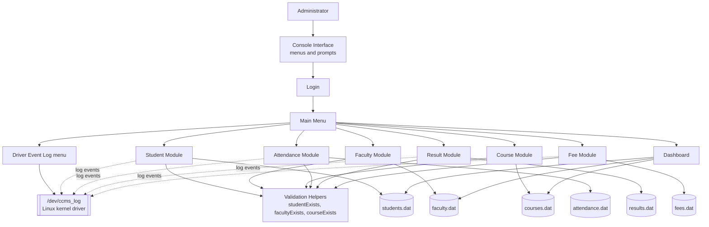
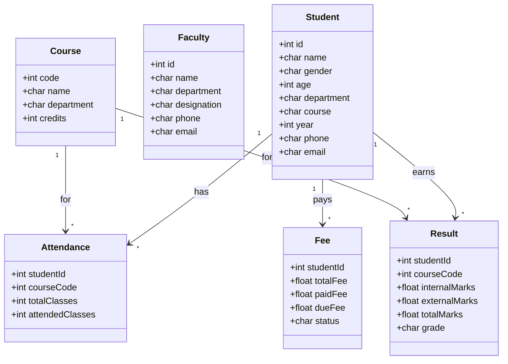
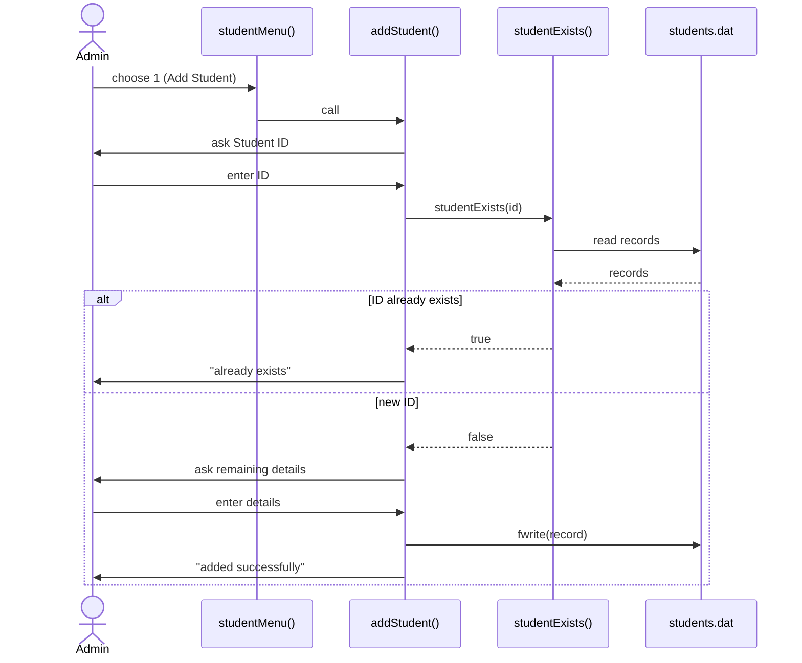
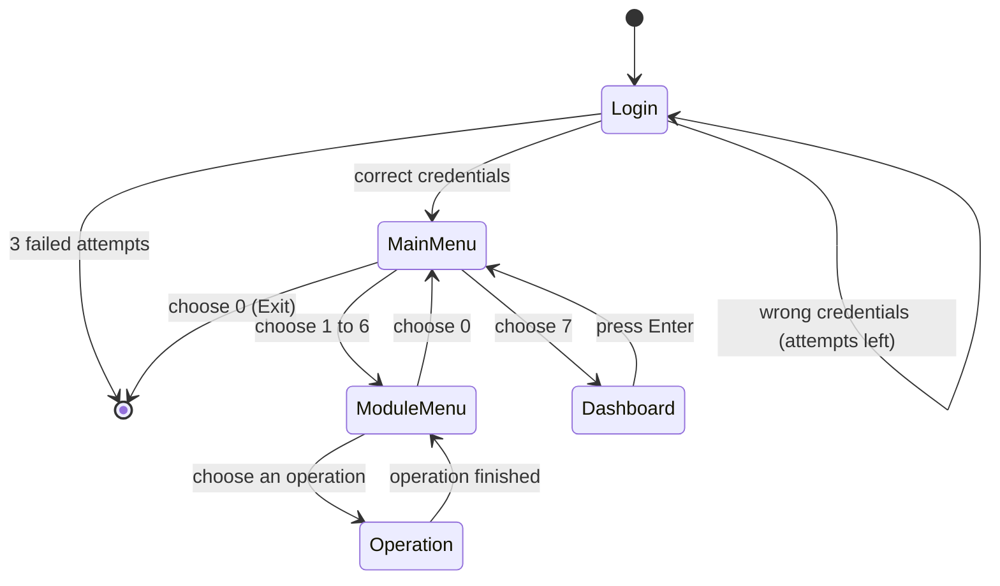
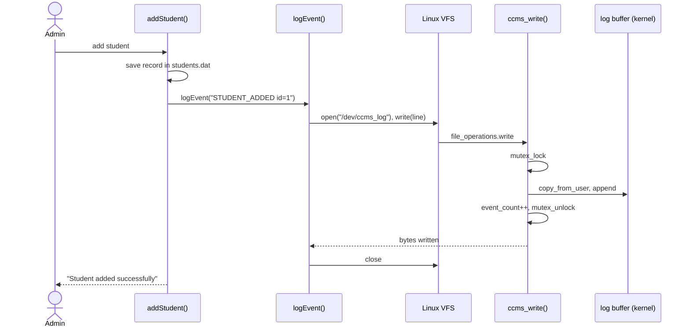
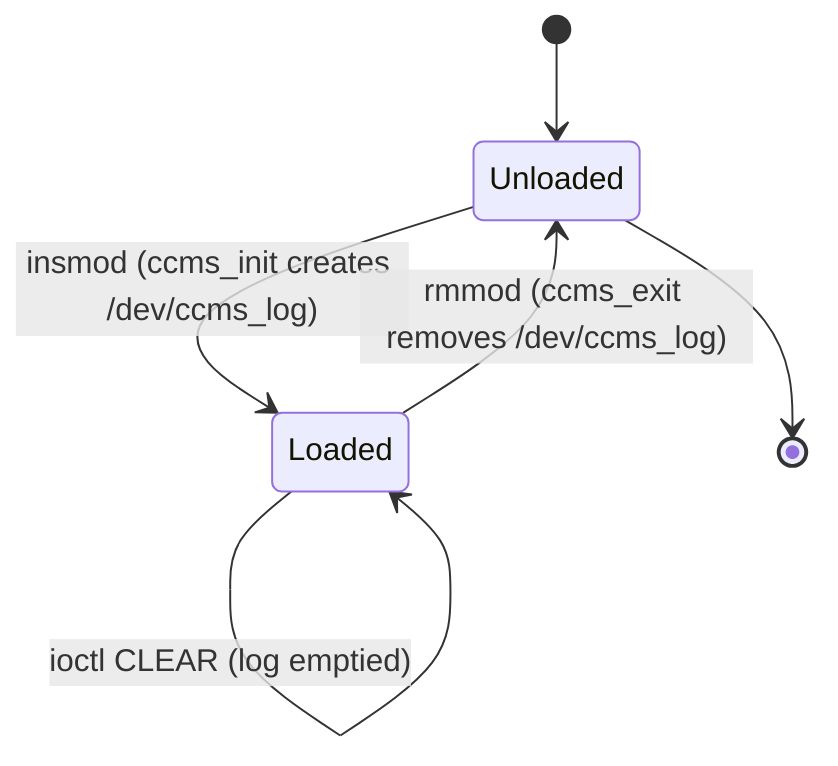

# Stage 3 - System Design and Architecture

## 1. High-level architecture

The program has three layers: a console interface, the application logic (one set of functions per module)
and a file-based storage layer.



## 2. Components and responsibilities

| Component | Responsibility |
|-----------|----------------|
| Input utilities | Read validated integers, floats and text lines; pause and clear the screen; print the header |
| Login | Check username and password with 3 attempts |
| Validation helpers | Check whether a student, faculty member or course already exists |
| Student / Faculty / Course modules | Maintain the master records |
| Attendance / Result / Fee modules | Maintain records that depend on a student and a course |
| Dashboard | Count records in three files |
| Driver interface | `logEvent` writes events to `/dev/ccms_log`; menu 8 reads the log and calls `ioctl` |
| Kernel driver (`ccms_log`) | Owns the log buffer in kernel memory and serves `open`, `read`, `write`, `ioctl` |
| Main menu | Route the administrator to a module |

## 3. Data structures

```c
typedef struct { int id; char name[80]; char gender[15]; int age;
                 char department[60]; char course[60]; int year;
                 char phone[20]; char email[80]; } Student;

typedef struct { int id; char name[80]; char department[60];
                 char designation[50]; char phone[20]; char email[80]; } Faculty;

typedef struct { int code; char name[80]; char department[60]; int credits; } Course;

typedef struct { int studentId; int courseCode; int totalClasses; int attendedClasses; } Attendance;

typedef struct { int studentId; int courseCode; float internalMarks; float externalMarks;
                 float totalMarks; char grade[5]; } Result;

typedef struct { int studentId; float totalFee; float paidFee; float dueFee; char status[20]; } Fee;
```

Each record is one `struct`; a file is an array of fixed-size records written with `fwrite`.

## 4. UML diagrams

### 4.1 Class (data model) diagram



### 4.2 Sequence diagram - Add Student



### 4.3 State machine diagram - program navigation



## 5. System programming concepts used

* **File handling:** binary files opened with `fopen` in `ab`, `rb`, `rb+` and `wb` modes; `fread`, `fwrite`, `fseek` for in-place update.
* **Delete operation:** copy the records to keep into a temporary file, then `remove` the original and `rename` the temporary file.
* **Process interaction:** `system()` is used to clear the console.
* **Input handling:** buffer clearing and validation to keep the standard input stream consistent.

## 6. Implementation plan
Build in this order: utilities and login, student module, faculty, course, attendance, result, fee,
dashboard, main menu, then validation.

## 7. Development environment

| Item | Choice |
|------|--------|
| Operating system | Windows 11 |
| Compiler | GCC, installed through MSYS2 UCRT64 |
| Editor | Any text editor or Visual Studio Code |
| Version control | Git with a GitHub repository |
| Build command | `gcc src/main.c -o college_management` |

## 8. Git repository and branching strategy

* `main` branch: always holds a working version.
* `dev` branch: day-to-day work; merged into `main` when a stage is complete.
* One commit per finished feature with a clear message, for example `Add duplicate ID check for students`.
* Tags at the end of each stage: `stage1` ... `stage6`.

## 9. Documentation and progress tracking
One document per stage in the `docs` folder; progress and issues are recorded in `Stage4_Prototype_and_Progress.md`
and in the Git commit history.

## 10. Linux device driver design

### 10.1 Purpose
The driver adds a kernel-level component: a character device `/dev/ccms_log` that holds an audit trail of what
the administrator does. The application is the only writer; the administrator reads the log from menu 8 or with `cat`.

### 10.2 Driver concepts used

| Concept | Where |
|---------|-------|
| Loadable kernel module | `module_init(ccms_init)`, `module_exit(ccms_exit)`, `MODULE_LICENSE("GPL")` |
| Device number | `alloc_chrdev_region` / `unregister_chrdev_region` |
| Character device | `cdev_init`, `cdev_add`, `cdev_del` |
| Automatic device node | `class_create`, `device_create`, `device_destroy`, `class_destroy` |
| File operations | `struct file_operations`: `open`, `release`, `read`, `write`, `unlocked_ioctl` |
| Kernel/user data transfer | `copy_from_user`, `simple_read_from_buffer`, `put_user` |
| ioctl interface | commands built with `_IO` / `_IOR` in `ccms_ioctl.h` |
| Synchronization | `DEFINE_MUTEX`, `mutex_lock`, `mutex_unlock` |
| Error handling | `-ENOSPC`, `-EFAULT`, `-ENOTTY`, `goto` clean-up in `ccms_init` |
| Kernel logging | `pr_info`, visible with `dmesg` |

### 10.3 Driver interface

| Operation | Behaviour |
|-----------|-----------|
| `write` | Appends up to 256 bytes (one event). Returns `-ENOSPC` when the 8192-byte log is full. |
| `read` | Returns the stored log from the current file position; 0 at the end. |
| `ioctl CCMS_IOC_GET_COUNT` | Returns the number of events written. |
| `ioctl CCMS_IOC_GET_USED` | Returns the number of bytes used. |
| `ioctl CCMS_IOC_CLEAR` | Empties the log. |
| any other `ioctl` | Returns `-ENOTTY`. |

### 10.4 Sequence diagram - logging an event



### 10.5 State machine - driver life cycle



### 10.6 Design decisions
* The application ignores a missing driver, so the college features never depend on the kernel module.
* The log is kept in memory and is not persistent; the `.dat` files remain the permanent store.
* `CCMS_DEVICE` can point the application at another file, which allows testing without loading the module.
* The build, load and unload steps are scripted in the `scripts` folder.
